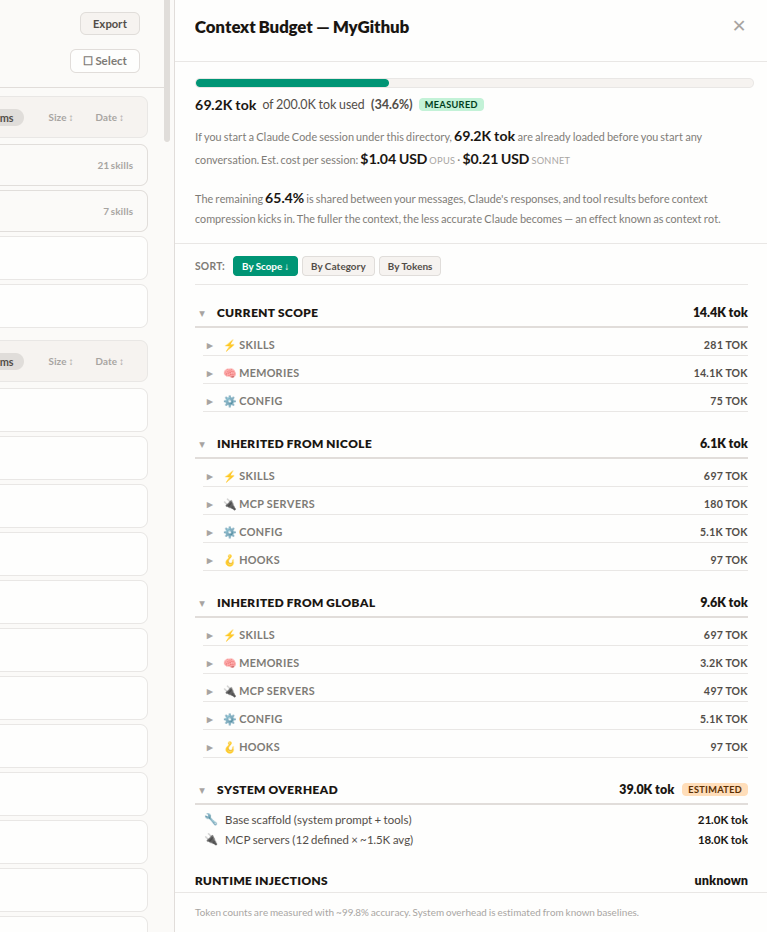

# Claude Code Organizer

[](https://www.npmjs.com/package/@mcpware/claude-code-organizer)
[](LICENSE)
[](https://nodejs.org)

[English](README.md) | 简体中文 | [繁體中文](README.zh-TW.md) | [廣東話](README.zh-HK.md) | [日本語](README.ja.md) | [한국어](README.ko.md) | [Español](README.es.md) | [Bahasa Indonesia](README.id.md) | [Italiano](README.it.md) | [Português](README.pt-BR.md) | [Türkçe](README.tr.md) | [Tiếng Việt](README.vi.md) | [ไทย](README.th.md)

**一个仪表盘，帮你管理 Claude Code 的所有记忆、技能、MCP 服务器和钩子 — 按作用域分层展示，拖拽即可跨作用域移动。**


## 问题

你可能没注意过，Claude Code 每次启动的时候，你的 context window 已经被吃掉一大块了。

### 还没开始写代码，token 预算就少了三分之一

Claude Code 启动时会自动预加载一堆配置文件 — CLAUDE.md、记忆、技能、MCP server 定义、Hook、规则等等。你还没说话，它就已经全塞进 context window 了。

看一个真实项目，用了两周之后是这样的：



**69.2K tokens — 直接占掉你 200K context window 的 34.6%。** 一个字都没打就没了。每次 session 光这些 overhead 的成本：Opus $1.04 USD，Sonnet $0.21 USD。

剩下的 65.4% 要跟你的对话、Claude 的回复、tool results 抢空间。context 越满 Claude 越不准，这叫 **context rot**。

69.2K 怎么来的？就是所有能离线测量的 config 文件 token 加总，再加上一个估算的系统开销（~21K tokens）— system prompt、23+ 个内置 tool 定义、MCP tool schemas，每次 API call 都会加载。

但这还只是**静态**部分。下面这些 **runtime injections** 根本没算进去：

- **Rule re-injection** — 所有 rule 文件在每次 tool call 后都会重新注入 context。大约 30 次 tool call 后，光这一项就能吃掉 ~46% 的 context window
- **File change diffs** — 你读过或写过的文件被外部修改（比如 linter），整个 diff 会作为隐藏的 system-reminder 注入
- **System reminders** — malware 警告、token 提示等隐藏 injections
- **Conversation history** — 你的消息、Claude 的回复和所有 tool results 每次 API call 都重新发送

所以 session 进行到一半的时候，实际用量远高于 69.2K。你只是看不到。

### 配置散落在错误的位置

另一个问题：Claude Code 工作时会默默创建记忆、技能、MCP config、命令和规则，然后直接丢进当前目录对应的 scope。

它还会在不同 scope 里悄悄重复安装 MCP server。你不仔细看根本发现不了：


Teams 装了两次、Gmail 装了三次、Playwright 装了三次 — 每个副本每次 session 都在白白消耗 token。scope 标签（`Global` / `nicole`）清楚标出了每个重复项在哪，方便你决定留哪个、删哪个。

结果就是：
- 你想全局生效的偏好，被锁在某个项目里
- 只属于某个仓库的 deploy 技能，泄漏到 global 污染所有其他项目
- Python pipeline 技能放在 global，每次开 React session 都会被加载
- 重复的 MCP entry 导致同一个 server 初始化两次
- 过时的记忆和当前指令互相矛盾

每个放错位置的东西都在浪费 token **并且**降低准确度。而你没有任何一条命令可以一次看到所有 scope 的全貌。

### 解决：一条命令开仪表盘

```bash
npx @mcpware/claude-code-organizer
```

看到 Claude 存了什么，按 scope 层级排好。**开始之前就知道你的 token 预算。** 拖拽移动、删过时记忆、找重复项。

> **首次运行自动安装 `/cco` skill** — 之后在任何 Claude Code session 输入 `/cco` 就能打开仪表盘。

### 示例：找出什么在吃你的 tokens

打开仪表盘，点 **Context Budget**，切到 **By Tokens** — 最大的消耗者排最上面。一个忘了的 2.4K token CLAUDE.md？一个在三个 scope 重复的技能？现在看到了。清理掉，省 10-20% context window。

### 示例：修复 scope 污染

你在某个项目里跟 Claude 说「我喜欢 TypeScript + ESM」，但这个偏好应该全局生效。把那条记忆从 Project 拖到 Global。**搞定，拖一下。** deploy 技能放在 global 但其实只有一个仓库用？拖进那个 Project scope — 其他项目就看不到了。

### 示例：删过时记忆

Claude 会自动记住你随口说的东西。一周后没用了但还是每次 session 都加载。浏览、阅读、删除。**你来决定 Claude 以为自己知道你什么。**

---

## 功能

- **作用域分层视图** — 全局 > 工作区 > 项目，清晰的层级关系，还有继承标记
- **拖拽移动** — 记忆、技能、MCP 服务器，拖一下就能换作用域
- **移动前确认** — 每次操作前弹确认框，不会误操作
- **类型隔离** — 记忆只能移到记忆文件夹，技能只能移到技能文件夹，不会搞混
- **搜索 & 筛选** — 实时搜索所有条目，支持按类别筛选（记忆、技能、MCP、配置、钩子、插件、计划）
- **Context Budget** — 在你开始输入之前就看到你的 config 占了多少 tokens — 逐项分析、继承的 scope 成本、系统开销估算、以及 200K context 的使用百分比
- **详情面板** — 点击任意条目查看元数据、描述、文件路径，还能直接用 VS Code 打开
- **零依赖** — 纯 Node.js 内置模块，SortableJS 走 CDN
- **真·文件移动** — 直接操作 `~/.claude/` 目录里的文件，不是什么只读查看器
- **100+ E2E 测试** — Playwright 测试套件，覆盖 filesystem 验证、安全性（路径穿越、格式错误输入）、context budget 和所有 11 个类别

## 快速上手

### 方式1：npx（免安装）

```bash
npx @mcpware/claude-code-organizer
```

### 方式2：全局安装

```bash
npm install -g @mcpware/claude-code-organizer
claude-code-organizer
```

### 方式3：让 Claude 帮你跑

直接把这段话丢给 Claude Code：

> 帮我跑 `npx @mcpware/claude-code-organizer`，这是一个管理 Claude Code 设置的仪表盘。跑起来之后告诉我 URL。

浏览器打开 `http://localhost:3847`，直接操作你本地的 `~/.claude/` 目录。

## 管理范围

| 类型 | 查看 | 跨作用域移动 |
|------|:----:|:----------:|
| 记忆（反馈、用户、项目、引用） | ✅ | ✅ |
| 技能 | ✅ | ✅ |
| MCP 服务器 | ✅ | ✅ |
| 配置（CLAUDE.md、settings.json） | ✅ | 🔒 |
| 钩子 | ✅ | 🔒 |
| 插件 | ✅ | 🔒 |
| 计划 | ✅ | 🔒 |

## 作用域层级

```
全局                          <- 到处生效
  公司 (工作区)                <- 下面所有子项目都继承
    公司仓库1                  <- 仅限这个项目
    公司仓库2                  <- 仅限这个项目
  个人项目 (项目)              <- 独立项目
  文档 (项目)                  <- 独立项目
```

子作用域自动继承父作用域的记忆、技能和 MCP 服务器配置。

## 原理

1. **扫描** `~/.claude/` — 找出所有项目、记忆、技能、MCP 服务器、钩子、插件、计划
2. **解析层级** — 根据文件系统路径推导出父子关系
3. **渲染仪表盘** — 作用域标题 > 类别栏 > 条目列表，自动缩进
4. **处理移动** — 拖拽或点"移动到…"，后台做完安全检查后直接移动文件

## 平台

| 平台 | 状态 |
|------|:----:|
| Ubuntu / Linux | ✅ 已支持 |
| macOS | 应该没问题（还没测） |
| Windows | 暂不支持 |
| WSL | 应该没问题（还没测） |

## 许可证

MIT

## 作者

[ithiria894](https://github.com/ithiria894) — 给 Claude Code 生态造轮子。
